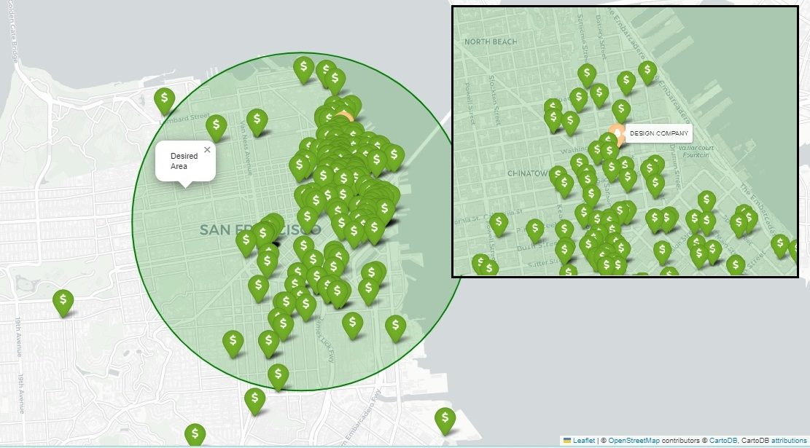
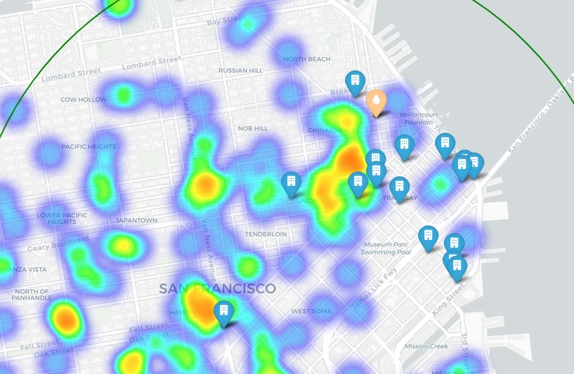

# Project III - GEOmover

## Introduction

This project covers the following scenario:

As a data engineer your goal is to place the new company offices in the best area for the company to grow. You have to find a place that more or less covers the following requirements:

- There must be some nearby companies that also do design.
- 30% of the company staff have at least 1 child.
- It should be near successful tech startups that have raised at least US$1M.
- Executives like Starbucks A LOT.
- Account managers need to travel a lot.
- Everyone in the company is between 25 and 40, give them some place to go party.
- The CEO is vegan.
- If you want to make the maintenance guy happy, a basketball stadium must be around 10 Km.
- The office dog—"Dobby" needs a hairdresser every month. Ensure there's one not too far away.

## Description
### General search
The select approach to this project was **OPTION A**, that consists in acquiring the office of an existing company in the database.

For the business to thrive it is important to stay close and connected to design companies and startups so there could be potential exchange.
Search in Mongo for these locations were:

```python
#DESIGN companies
query = {"category_code":"design"}
projection = {"name":1, "_id":0, "offices.city":1}
desing = list(c.find(query, projection))
```
The number of matches were:
- San Francisco    1
- Collingwood      1
- Berlin           1
- Ellensburg       1
- Brooklyn         1
- London           1


```python
#GAMING companies - competition/exchange
condition1 = {"category_code":"games_video"}
condition2 = {"funding_rounds.raised_amount":{"$gt": 1000000}}
query = {"$and":[condition1,condition2]}
projection = {"name":1, "_id":0, "offices.city":1}
```
Top 3 gaming cities:
- San Francisco has 39 companies;
- New York has 30;
- Los Angeles has 11.

```python
#WEB related companies 
condition1 = {"category_code":"web"}
condition2 = {"funding_rounds.raised_amount":{"$gt": 1000000}}
query = {"$and":[condition1,condition2]}
projection = {"name":1, "_id":0, "offices.city":1}
```
Top 3 web cities:
- San Francisco has 71 companies;
- New York has 65;
- Palo Alto 22.

Analizing how the list of cities with design companies intersects with Gaming and Web companies, the most appropriate city for the office would be **SAN FRANCISCO**, eventhough there is a lot of **competiton**, there is also potential **talent available in the city**.

### Search for an specific area within SAN FRANCISCO
In order to stay close to successfull startups that raised over US$1M, let's check out where these companies are located and how close they are to the DESIGN company.




Marked with a circle is the desired are. Let's now see wich offices could be good matches to the new company and its 87 employees.

A quick query through the database shows the number of offices with adequate size:
``` python
condition1 = {"number_of_employees":{"$lt": 120}}
condition2 = {"number_of_employees":{"$gte": 90}}
condition3 = {"offices.city":"San Francisco"}
query = {"$and":[condition1,condition2,condition3]}

pipeline = [
    {"$match": query},
    {"$unwind": "$offices"},
    {"$match": {"offices.city": "San Francisco"}},
    {"$project": {"_id": 0, "name": 1, "latitude": "$offices.latitude", "longitude": "$offices.longitude", "address": "$offices.address1"}}
]
```
Let's check in the map:


### Narrowing down the options
Now let's check the other demands from the staff.
1. Starbucks
2. Schools
3. Bars
4. Vegan places for eating 
5. Grooming places for pets




The heatmap shows that the area right bellow the location of the Design Company concentrates the most services that the empployees deem important, narrowing the selection of possible offices to:
 - Exente: 685, Market Street
 - hi5: 55 Second Street
 - Twilio: 645, Harrison
 - eBuddy: 55, Post Street

### Choosing a location
When pinpointing all the venues to cover the staff requirements, it becomes evident that the EXENT office is the one that has the most services available in the shortest distances and is closest to second best rated vegan restaurant in the city. The location also is 2 blocks away to a Park, so staff could enjoy meals outdoors and relax. Acess to the San Francisco International Airport is facilitated by the train station.

To make the maintenace guy happy, a Basketball stadium is within 2,5km as shown in the map.


## Conclusion
[x] There must be some nearby companies that also do design.
[ ] 30% of the company staff have at least 1 child. - The nearst school is several blocks away :pleading_face:
[x] It should be near successful tech startups that have raised at least US$1M.
[x] Executives like Starbucks A LOT.
[x] Account managers need to travel a lot.
[X] Everyone in the company is between 25 and 40, give them some place to go party.
[x] The CEO is vegan.
[ ] If you want to make the maintenance guy happy, a basketball stadium must be around 10 Km.
[x] The office dog—"Dobby" needs a hairdresser every month. Ensure there's one not too far away.


## Technologies
For this project eight different libraries were used:
- Pymongo
- Pandas
- Getpass
- Dotenv
- OS module
- Requests
- Json
- Folium
